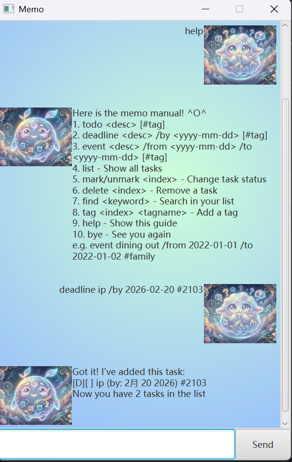

# Memo User Guide

Memo is a lightweight, personality-driven task management chatbot designed to help you track your daily tasks, deadlines, and events through a simple command-line interface. 
With its intuitive GUI, staying organized has never been more delightful.

## Quick Start

Ensure you have JDK 17 installed on your computer.

Download the latest version [here](https://github.com/ghyyuan/ip/releases/)

Run the application with `java -jar Memo.jar`

Type your command into the input box and press Enter to execute.

## Features

1. <ins>Task Management

   - **todo**
   
        Creates a basic task without any specific time constraint. You can add inline tags using the # symbol.

        Format: `todo <description> [#tag]`

        Example: `todo Read CS2103T topic #school`

   - **deadline**

        Creates a task with a specific due date.

        Format: `deadline <description> /by <yyyy-mm-dd> [#tag]`

        Example: `deadline Submit iP /by 2026-02-20 #urgent`

   - **event**

        Creates a task with a start and end date.

        Format: `event <description> /from <yyyy-mm-dd> /to <yyyy-mm-dd> [#tag]`

        Example: `event Team Meeting /from 2026-02-21 /to 2026-02-21 #project`

2. <ins>List and Status Management

   - **list**
    
        Displays all tasks currently in your list, including their completion status and tags.

        Format: `list`

   - **mark / unmark**

        Updates the completion status of a task using its index in the list.

        Format: `mark <index> or unmark <index>`

        Example: `mark 1`

   - **delete**

        Removes a specific task from your list.

        Format: `delete <index>`

        Example: `delete 2`

3. <ins>Organization and Search

   - **find**
   
        Searches for tasks whose descriptions contain the given keyword.

        Format: `find <keyword>`

        Example: `find school`

   - **tag**

        Appends a new tag to an existing task by its index.

        Format: `tag <index> <tagname>`

        Example: `tag 1 fun`

4. <ins>System Commands

   - **help**
   
        Displays a quick reference guide of all available commands.

        Format: `help`

   - **bye**

        Saves all changes to your local file and closes the application.

        Format: `bye`

## Usage Notes

### Prohibited Characters: 
For data integrity, the pipe character | and the comma , are forbidden in task descriptions and tag names. Using them will trigger an error.

### Tag Formatting:
Inline tags must start with a # followed immediately by content (e.g., #work is valid, while only # is not).

### Auto-Save: 
Memo automatically saves all your updates to data/text.txt. Your data is reloaded every time you launch the app.

## FAQ
**Q: Why does deadline /by 2026-01-01 result in an error?**
A: Every task requires a description. Use the format deadline [content] /by 2026-01-01.

**Q: Can I add multiple tags at once?**
A: Yes! When creating a task, you can include multiple # tags, such as todo workout #fitness #gym.

Enjoy staying organized with Memo! If you ever get stuck, just type `help`.
